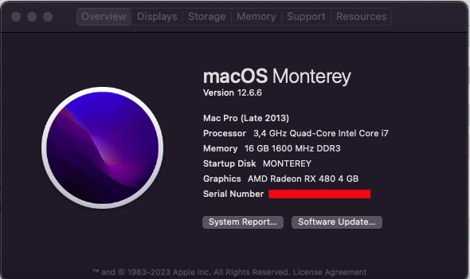

# Hackintosh GA-H77-DS3H with Monterey 12.6.6

My EFI Folder using clover OpenClover 0.93

Mother Board [GA-H77-DS3H](https://www.gigabyte.com/br/Motherboard/GA-H77-DS3H-rev-10/)

Graphic Card : [Radeon RX 480](https://www.amd.com/pt/support/graphics/radeon-400-series/radeon-rx-400-series/radeon-rx-480)



Running perfect, audio, lan, video, sensors, icloud, etc.

[Hardware list](./hardware_list.txt) created with [OCSysInfo](https://github.com/KernelWanderers/OCSysInfo)

## How to Use

This is the final EFI Folder after 1 week of lot of tests, a lot of reboots. 

This is a stable version of the Opencore settings needed to boot install and use OSX Monterey for this motherboard, with this video card.

Don't just grab that EFI folder without understanding what you're doing. The process of migrating from Clover to OpenCore is a necessary and very rich learning to be able to solve problems in case of OSX or Opencore updates.

To arrive at this configuration, many tests were necessary until it stabilized:
- the boot
- the video with 2 monitors
- all usb ports
- the CPU and GPU sensors
- and finally the network card

You can :
1 - Create a pendrive or an EFI partition using the clone of this project with only the EFI folder in the root of the partition and check if an image created from a mac OSX installation of Catalina, Big Sur or Monterey can boot in the case of Monterey an image created [using](https://support.apple.com/pt-br/HT201372)

```sh
sudo /Applications/Install\ macOS\ Monterey.app/Contents/Resources/createinstallmedia --volume /Volumes/MyVolume
```


And before testing, correct the snippet of the config.plist file using [GenSMBIOS](https://github.com/corpnewt/GenSMBIOS) to generate your values. A good explanation is described [here](https://dortania.github.io/OpenCore-Post-Install/universal/iservices.html#using-gensmbios) 


```xml
	<key>PlatformInfo</key>
	<dict>
		<key>Automatic</key>
		<true/>
		<key>CustomMemory</key>
		<false/>
		<key>Generic</key>
		<dict>
			<key>AdviseFeatures</key>
			<false/>
			<key>MaxBIOSVersion</key>
			<false/>
			<key>MLB</key>
			<string>USE_GenSMBIOS_AND_SET_YOURS</string>
			<key>ProcessorType</key>
			<integer>0</integer>
			<key>ROM</key>
			<data>USE_GenSMBIOS_AND_SET_YOURS</data>
			<key>SpoofVendor</key>
			<true/>
			<key>SystemMemoryStatus</key>
			<string>Auto</string>
			<key>SystemProductName</key>
			<string>MacPro6,1</string>
			<key>SystemSerialNumber</key>
			<string>USE_GenSMBIOS_AND_SET_YOURS</string>
			<key>SystemUUID</key>
			<string>USE_GenSMBIOS_AND_SET_YOURS</string>
		</dict>
```

OBS: The `MacPro6,1` is the first tested model to run OSX Monterey.


Good luck, patience and check at [tonymacx86](https://www.tonymacx86.com/threads/help-fix-ethernet-ar8151-mb-ga-h77-ds3h-on-monterey.326042/) how I fixed the last step networking..
